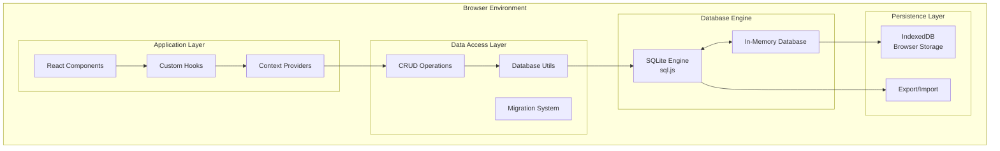
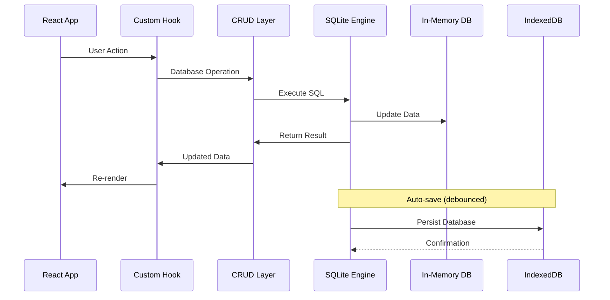

# Arquitetura do Banco de Dados

## Visão Geral da Estratégia de Dados

### Arquitetura Local-First
O Study Planner implementa uma arquitetura **Local-First** usando SQLite no browser com persistência automática via IndexedDB. Esta abordagem garante funcionamento offline completo, controle total dos dados pelo usuário e performance superior.



## Schema do Banco de Dados

### Estrutura Relacional Completa

#### Tabelas Principais

```sql
-- Planos de estudo principais
CREATE TABLE study_plans (
    id TEXT PRIMARY KEY,
    name TEXT NOT NULL,
    exam_date DATE,
    weekly_hours INTEGER,
    study_days TEXT, -- JSON array
    cycles INTEGER,
    created_at DATETIME DEFAULT CURRENT_TIMESTAMP,
    updated_at DATETIME DEFAULT CURRENT_TIMESTAMP,
    is_active BOOLEAN DEFAULT 0
);

-- Matérias dentro dos planos
CREATE TABLE study_subjects (
    id TEXT PRIMARY KEY,
    plan_id TEXT NOT NULL,
    name TEXT NOT NULL,
    weight INTEGER NOT NULL,
    color TEXT,
    order_index INTEGER,
    created_at DATETIME DEFAULT CURRENT_TIMESTAMP,
    FOREIGN KEY (plan_id) REFERENCES study_plans(id) ON DELETE CASCADE
);

-- Tópicos dentro das matérias
CREATE TABLE study_topics (
    id TEXT PRIMARY KEY,
    subject_id TEXT NOT NULL,
    name TEXT NOT NULL,
    weight INTEGER NOT NULL,
    priority INTEGER DEFAULT 3,
    estimated_hours REAL,
    completed_hours REAL DEFAULT 0,
    created_at DATETIME DEFAULT CURRENT_TIMESTAMP,
    FOREIGN KEY (subject_id) REFERENCES study_subjects(id) ON DELETE CASCADE
);

-- Subtópicos (até 3 níveis de hierarquia)
CREATE TABLE study_subtopics (
    id TEXT PRIMARY KEY,
    topic_id TEXT NOT NULL,
    parent_id TEXT,
    name TEXT NOT NULL,
    weight INTEGER NOT NULL,
    priority INTEGER DEFAULT 3,
    estimated_hours REAL,
    completed_hours REAL DEFAULT 0,
    level INTEGER DEFAULT 1,
    created_at DATETIME DEFAULT CURRENT_TIMESTAMP,
    FOREIGN KEY (topic_id) REFERENCES study_topics(id) ON DELETE CASCADE,
    FOREIGN KEY (parent_id) REFERENCES study_subtopics(id) ON DELETE CASCADE
);
```

#### Tabelas de Sessões e Progresso

```sql
-- Sessões individuais de estudo
CREATE TABLE study_sessions (
    id TEXT PRIMARY KEY,
    plan_id TEXT,
    subject_id TEXT,
    topic_id TEXT,
    subtopic_id TEXT,
    duration_minutes INTEGER NOT NULL,
    focus_rating INTEGER, -- 1-5 stars
    notes TEXT,
    session_date DATE NOT NULL,
    session_time TIME NOT NULL,
    created_at DATETIME DEFAULT CURRENT_TIMESTAMP,
    FOREIGN KEY (plan_id) REFERENCES study_plans(id),
    FOREIGN KEY (subject_id) REFERENCES study_subjects(id),
    FOREIGN KEY (topic_id) REFERENCES study_topics(id),
    FOREIGN KEY (subtopic_id) REFERENCES study_subtopics(id)
);

-- Logs diários agregados
CREATE TABLE daily_logs (
    id TEXT PRIMARY KEY,
    plan_id TEXT NOT NULL,
    log_date DATE NOT NULL,
    total_minutes INTEGER DEFAULT 0,
    sessions_count INTEGER DEFAULT 0,
    subjects_studied TEXT, -- JSON array
    average_focus REAL,
    created_at DATETIME DEFAULT CURRENT_TIMESTAMP,
    FOREIGN KEY (plan_id) REFERENCES study_plans(id),
    UNIQUE(plan_id, log_date)
);
```

#### Tabelas de Planos Salvos

```sql
-- Planos nomeados salvos pelo usuário
CREATE TABLE saved_plans (
    id TEXT PRIMARY KEY,
    name TEXT NOT NULL,
    plan_data TEXT NOT NULL, -- JSON serialized
    description TEXT,
    created_at DATETIME DEFAULT CURRENT_TIMESTAMP,
    updated_at DATETIME DEFAULT CURRENT_TIMESTAMP
);
```

#### Tabelas de Configurações e Metas

```sql
-- Configurações da aplicação
CREATE TABLE app_settings (
    key TEXT PRIMARY KEY,
    value TEXT NOT NULL,
    type TEXT NOT NULL, -- 'string', 'number', 'boolean', 'json'
    category TEXT,
    description TEXT,
    created_at DATETIME DEFAULT CURRENT_TIMESTAMP,
    updated_at DATETIME DEFAULT CURRENT_TIMESTAMP
);

-- Metas de estudo
CREATE TABLE study_goals (
    id TEXT PRIMARY KEY,
    title TEXT NOT NULL,
    description TEXT,
    target_type TEXT NOT NULL, -- 'hours', 'sessions', 'topics', 'custom'
    target_value REAL NOT NULL,
    current_value REAL DEFAULT 0,
    subject_id TEXT,
    deadline DATE,
    status TEXT DEFAULT 'active', -- 'active', 'completed', 'paused', 'cancelled'
    priority INTEGER DEFAULT 3,
    created_at DATETIME DEFAULT CURRENT_TIMESTAMP,
    updated_at DATETIME DEFAULT CURRENT_TIMESTAMP,
    FOREIGN KEY (subject_id) REFERENCES study_subjects(id)
);

-- Métricas de performance agregadas
CREATE TABLE performance_metrics (
    id TEXT PRIMARY KEY,
    date DATE NOT NULL,
    metric_type TEXT NOT NULL, -- 'daily', 'weekly', 'monthly'
    total_study_time INTEGER, -- minutes
    sessions_count INTEGER,
    average_session_duration REAL,
    focus_score_average REAL,
    consistency_score REAL,
    productivity_index REAL,
    subjects_covered INTEGER,
    goals_achieved INTEGER,
    streak_days INTEGER,
    created_at DATETIME DEFAULT CURRENT_TIMESTAMP,
    UNIQUE(date, metric_type)
);
```

#### Tabelas do Sistema de Batalhas

```sql
-- Dados do sistema de gamificação
CREATE TABLE battle_data (
    id TEXT PRIMARY KEY DEFAULT 'player_data',
    player_level INTEGER DEFAULT 1,
    player_xp INTEGER DEFAULT 0,
    player_hp INTEGER DEFAULT 100,
    player_max_hp INTEGER DEFAULT 100,
    current_enemy_id TEXT,
    current_enemy_hp INTEGER,
    current_enemy_max_hp INTEGER,
    battle_streak INTEGER DEFAULT 0,
    total_enemies_defeated INTEGER DEFAULT 0,
    created_at DATETIME DEFAULT CURRENT_TIMESTAMP,
    updated_at DATETIME DEFAULT CURRENT_TIMESTAMP
);

-- Inimigos disponíveis
CREATE TABLE enemies (
    id TEXT PRIMARY KEY,
    name TEXT NOT NULL,
    type TEXT NOT NULL, -- 'slime', 'goblin', 'orc', 'dragon'
    max_hp INTEGER NOT NULL,
    attack_power INTEGER NOT NULL,
    defense INTEGER DEFAULT 0,
    xp_reward INTEGER NOT NULL,
    unlock_level INTEGER DEFAULT 1,
    image_url TEXT,
    description TEXT,
    created_at DATETIME DEFAULT CURRENT_TIMESTAMP
);
```

#### Tabelas do Sistema de Questões

```sql
-- Questões de estudo
CREATE TABLE questions (
    id TEXT PRIMARY KEY,
    subject_id TEXT,
    topic_id TEXT,
    question_text TEXT NOT NULL,
    question_type TEXT NOT NULL, -- 'multiple_choice', 'true_false', 'essay', 'fill_blank'
    difficulty TEXT DEFAULT 'medium', -- 'easy', 'medium', 'hard'
    options TEXT, -- JSON array for multiple choice
    correct_answer TEXT NOT NULL,
    explanation TEXT,
    tags TEXT, -- JSON array
    source TEXT,
    created_at DATETIME DEFAULT CURRENT_TIMESTAMP,
    FOREIGN KEY (subject_id) REFERENCES study_subjects(id),
    FOREIGN KEY (topic_id) REFERENCES study_topics(id)
);

-- Respostas dos usuários
CREATE TABLE question_attempts (
    id TEXT PRIMARY KEY,
    question_id TEXT NOT NULL,
    user_answer TEXT NOT NULL,
    is_correct BOOLEAN NOT NULL,
    time_taken INTEGER, -- seconds
    session_id TEXT,
    attempted_at DATETIME DEFAULT CURRENT_TIMESTAMP,
    FOREIGN KEY (question_id) REFERENCES questions(id),
    FOREIGN KEY (session_id) REFERENCES study_sessions(id)
);
```

## Estratégia de Persistência

### Fluxo de Dados Local-First



### Inicialização do Banco

```typescript
// Processo de inicialização completo
async function initializeDatabase() {
  // 1. Carregar SQLite engine
  const SQL = await initSqlJs({
    locateFile: (file) => `https://sql.js.org/dist/${file}`
  });
  
  // 2. Tentar carregar dados existentes do IndexedDB
  const existingData = await idbKeyval.get('lovable_sqlite_db');
  
  // 3. Criar instância do banco
  const db = existingData 
    ? new SQL.Database(new Uint8Array(existingData))
    : new SQL.Database();
  
  // 4. Aplicar schema se banco novo
  if (!existingData) {
    db.exec(schema);
  }
  
  // 5. Executar migrações se necessário
  await runMigrations(db);
  
  return db;
}
```

### Sistema de Auto-Save

```typescript
// Debounced save para performance
function setupAutoSave(db: Database) {
  let saveTimeout: NodeJS.Timeout;
  
  const scheduleSave = () => {
    clearTimeout(saveTimeout);
    saveTimeout = setTimeout(async () => {
      try {
        const data = db.export();
        await idbKeyval.set('lovable_sqlite_db', data);
        console.log('Database auto-saved to IndexedDB');
      } catch (error) {
        console.error('Auto-save failed:', error);
      }
    }, 1000); // 1 segundo de debounce
  };
  
  return scheduleSave;
}
```

## Operações CRUD Modularizadas

### Estrutura Modular

```
src/db/crud/
├── index.ts              # Exports centralizados
├── appSettings.ts        # Configurações da aplicação
├── studyGoals.ts         # Metas de estudo
├── performanceMetrics.ts # Métricas de performance
├── battle.ts             # Dados de gamificação
├── enemies.ts            # Inimigos do sistema
└── questions.ts          # Sistema de questões
```

### Exemplo de CRUD Modularizado

```typescript
// src/db/crud/studyGoals.ts
export interface StudyGoal {
  id: string;
  title: string;
  targetType: 'hours' | 'sessions' | 'topics';
  targetValue: number;
  currentValue: number;
  status: 'active' | 'completed' | 'paused';
  deadline?: string;
  priority: number;
}

export function saveStudyGoal(goal: StudyGoal): void {
  const db = getDBOrThrow();
  const sql = `
    INSERT OR REPLACE INTO study_goals 
    (id, title, target_type, target_value, current_value, status, deadline, priority, updated_at)
    VALUES (?, ?, ?, ?, ?, ?, ?, ?, CURRENT_TIMESTAMP)
  `;
  
  db.run(sql, [
    goal.id, goal.title, goal.targetType, goal.targetValue,
    goal.currentValue, goal.status, goal.deadline, goal.priority
  ]);
  
  // Auto-save trigger
  scheduleSave();
}

export function loadStudyGoals(status?: string): StudyGoal[] {
  const db = getDBOrThrow();
  const sql = status 
    ? 'SELECT * FROM study_goals WHERE status = ? ORDER BY priority DESC, created_at DESC'
    : 'SELECT * FROM study_goals ORDER BY priority DESC, created_at DESC';
  
  const params = status ? [status] : [];
  const stmt = db.prepare(sql);
  const results = stmt.getAsObject(params);
  
  return results.map(row => ({
    id: row.id as string,
    title: row.title as string,
    targetType: row.target_type as StudyGoal['targetType'],
    targetValue: row.target_value as number,
    currentValue: row.current_value as number,
    status: row.status as StudyGoal['status'],
    deadline: row.deadline as string,
    priority: row.priority as number
  }));
}
```

## Índices e Otimização

### Índices para Performance

```sql
-- Índices para queries frequentes
CREATE INDEX idx_study_sessions_date ON study_sessions(session_date);
CREATE INDEX idx_study_sessions_subject ON study_sessions(subject_id);
CREATE INDEX idx_study_sessions_plan ON study_sessions(plan_id);
CREATE INDEX idx_daily_logs_date ON daily_logs(log_date);
CREATE INDEX idx_performance_metrics_date_type ON performance_metrics(date, metric_type);
CREATE INDEX idx_questions_subject_topic ON questions(subject_id, topic_id);
CREATE INDEX idx_question_attempts_question ON question_attempts(question_id);

-- Índices compostos para consultas complexas
CREATE INDEX idx_sessions_plan_date ON study_sessions(plan_id, session_date);
CREATE INDEX idx_topics_subject_priority ON study_topics(subject_id, priority);
```

### Otimizações de Query

```typescript
// Prepared statements para queries frequentes
const commonQueries = {
  // Query otimizada para dashboard
  getDashboardData: db.prepare(`
    SELECT 
      s.name as subject_name,
      SUM(ss.duration_minutes) as total_minutes,
      COUNT(ss.id) as session_count,
      AVG(ss.focus_rating) as avg_focus
    FROM study_subjects s
    LEFT JOIN study_sessions ss ON s.id = ss.subject_id 
      AND ss.session_date >= date('now', '-7 days')
    WHERE s.plan_id = ?
    GROUP BY s.id, s.name
    ORDER BY total_minutes DESC
  `),
  
  // Query para métricas de performance
  getWeeklyMetrics: db.prepare(`
    SELECT 
      date,
      total_study_time,
      sessions_count,
      focus_score_average
    FROM performance_metrics
    WHERE metric_type = 'daily' 
      AND date >= date('now', '-7 days')
    ORDER BY date ASC
  `)
};
```

## Sistema de Migrações

### Versionamento de Schema

```typescript
// src/db/migration.ts
interface Migration {
  version: number;
  description: string;
  up: (db: Database) => void;
  down?: (db: Database) => void;
}

const migrations: Migration[] = [
  {
    version: 1,
    description: 'Add battle system tables',
    up: (db) => {
      db.exec(`
        CREATE TABLE IF NOT EXISTS battle_data (
          id TEXT PRIMARY KEY DEFAULT 'player_data',
          player_level INTEGER DEFAULT 1,
          player_xp INTEGER DEFAULT 0,
          created_at DATETIME DEFAULT CURRENT_TIMESTAMP
        );
      `);
    }
  },
  {
    version: 2,
    description: 'Add questions system',
    up: (db) => {
      db.exec(`
        CREATE TABLE IF NOT EXISTS questions (
          id TEXT PRIMARY KEY,
          subject_id TEXT,
          question_text TEXT NOT NULL,
          question_type TEXT NOT NULL,
          created_at DATETIME DEFAULT CURRENT_TIMESTAMP
        );
      `);
    }
  }
];

export function runMigrations(db: Database): void {
  // Implementação do sistema de migrações
  const currentVersion = getCurrentSchemaVersion(db);
  
  migrations
    .filter(m => m.version > currentVersion)
    .forEach(migration => {
      console.log(`Running migration ${migration.version}: ${migration.description}`);
      migration.up(db);
      updateSchemaVersion(db, migration.version);
    });
}
```

## Backup e Recovery

### Sistema de Export/Import

```typescript
// Export completo do banco
export function exportDatabase(): Blob {
  const db = getDBOrThrow();
  const data = db.export();
  return new Blob([data], { type: 'application/octet-stream' });
}

// Import com validação
export function importDatabase(file: File): Promise<boolean> {
  return new Promise((resolve, reject) => {
    const reader = new FileReader();
    reader.onload = async (e) => {
      try {
        const arrayBuffer = e.target?.result as ArrayBuffer;
        const uint8Array = new Uint8Array(arrayBuffer);
        
        // Validar dados antes de importar
        if (validateDatabaseStructure(uint8Array)) {
          await idbKeyval.set('lovable_sqlite_db', uint8Array);
          resolve(true);
        } else {
          reject(new Error('Invalid database format'));
        }
      } catch (error) {
        reject(error);
      }
    };
    reader.readAsArrayBuffer(file);
  });
}
```

### Recuperação Automática

```typescript
// Sistema de recovery em caso de corrupção
export function attemptDatabaseRecovery(): boolean {
  try {
    // Tentar carregar backup mais recente
    const backupData = localStorage.getItem('db_backup_emergency');
    if (backupData) {
      const restored = JSON.parse(backupData);
      // Reconstruir banco a partir do backup
      return rebuildFromBackup(restored);
    }
    return false;
  } catch (error) {
    console.error('Database recovery failed:', error);
    return false;
  }
}
```

## Considerações de Performance

### Otimizações Implementadas

1. **Prepared Statements**: Para queries frequentes
2. **Índices Estratégicos**: Baseados em padrões de uso
3. **Batch Operations**: Múltiplas operações em uma transação
4. **Lazy Loading**: Carregar dados conforme necessário
5. **Debounced Saves**: Evitar salvamentos excessivos

### Monitoramento de Performance

```typescript
// Métricas de performance do banco
export function getDatabaseMetrics() {
  const db = getDBOrThrow();
  
  return {
    tablesSizes: getTableSizes(db),
    queryStats: getQueryExecutionStats(),
    indexUsage: getIndexUsageStats(db),
    lastSaveTime: getLastSaveTimestamp()
  };
}
```

## Segurança e Integridade

### Validação de Dados

```typescript
// Validação antes de operações críticas
function validateStudyPlan(plan: StudyPlan): boolean {
  return (
    plan.id?.length > 0 &&
    plan.examDate instanceof Date &&
    plan.weeklyHours >= 10 &&
    plan.weeklyHours <= 80 &&
    plan.subjects?.length >= 2
  );
}
```

### Transações ACID

```typescript
// Operações críticas em transação
export function updateStudyPlanWithSessions(
  plan: StudyPlan, 
  sessions: StudySession[]
): boolean {
  const db = getDBOrThrow();
  
  try {
    db.exec('BEGIN TRANSACTION');
    
    // Atualizar plano
    saveStudyPlan(plan);
    
    // Salvar sessões
    sessions.forEach(session => saveStudySession(session));
    
    // Recalcular métricas
    updatePerformanceMetrics(plan.id);
    
    db.exec('COMMIT');
    return true;
  } catch (error) {
    db.exec('ROLLBACK');
    console.error('Transaction failed:', error);
    return false;
  }
}
```

Esta arquitetura garante robustez, performance e escalabilidade para o sistema de dados do Study Planner, mantendo todos os benefícios de uma aplicação Local-First com a confiabilidade de um banco de dados relacional.