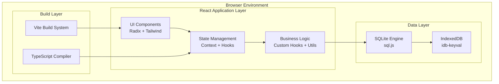
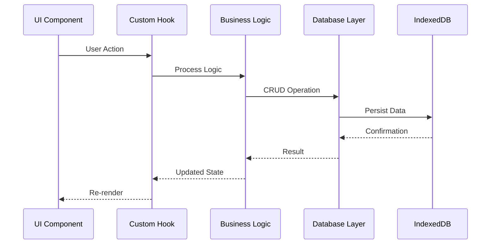
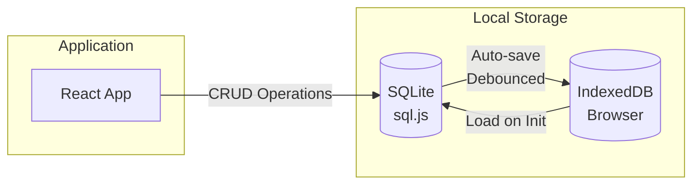

# Arquitetura do Sistema

## Visão Arquitetural Geral

### Padrão Arquitetural Principal
**Client-Side Single Page Application (SPA)** com persistência local, seguindo padrões de **Component-Based Architecture** e **Local-First Software**.



## Camadas da Arquitetura

### 1. Presentation Layer (Camada de Apresentação)

#### Responsabilidades
- Renderização da interface do usuário
- Captura de eventos e interações
- Apresentação de dados formatados
- Navegação entre telas

#### Componentes Principais
```
src/components/
├── ui/                 # Componentes base (Radix UI + customizações)
├── study/             # Componentes específicos de estudo
├── battle/            # Componentes de gamificação
├── questions/         # Componentes de questões
└── Dashboard.tsx      # Dashboard principal
```

#### Tecnologias
- **React 18**: Framework principal com Concurrent Features
- **TypeScript**: Type safety e developer experience
- **Radix UI**: Componentes acessíveis e sem estilo
- **Tailwind CSS**: Utility-first styling com design system
- **Lucide React**: Iconografia consistente

### 2. Application Layer (Camada de Aplicação)

#### Responsabilidades
- Gerenciamento de estado global
- Orquestração de fluxos de negócio
- Coordenação entre camadas
- Lógica de apresentação

#### Estrutura
```
src/
├── contexts/          # React Contexts para estado global
│   ├── DBProvider.tsx    # Contexto do banco de dados
│   └── StudyContext.tsx  # Contexto de estudo
├── hooks/             # Custom hooks reutilizáveis
├── pages/             # Componentes de página
└── utils/             # Utilitários específicos da aplicação
```

#### Padrões Implementados
- **Context API**: Estado global sem prop drilling
- **Custom Hooks**: Encapsulamento de lógica reutilizável
- **Component Composition**: Composição sobre herança
- **Render Props**: Compartilhamento de lógica entre componentes

### 3. Domain Layer (Camada de Domínio)

#### Responsabilidades
- Regras de negócio puras
- Cálculos algorítmicos
- Validações de domínio
- Transformações de dados

#### Estrutura
```
src/
├── types/             # Definições de tipos TypeScript
│   ├── study.ts         # Tipos do domínio de estudo
│   ├── battle.ts        # Tipos do sistema de batalhas
│   └── questions.ts     # Tipos do sistema de questões
└── utils/             # Lógica de domínio pura
    ├── priorityCalculation.ts    # Algoritmos de priorização
    ├── autoWeightAdjustment.ts   # Ajustes automáticos
    └── studyPlanPersistence.ts   # Lógica de persistência
```

#### Princípios Aplicados
- **Pure Functions**: Funções sem side effects
- **Immutability**: Dados imutáveis para previsibilidade
- **Type Safety**: Tipagem forte para reduzir erros
- **Single Responsibility**: Cada função tem uma responsabilidade

### 4. Infrastructure Layer (Camada de Infraestrutura)

#### Responsabilidades
- Persistência de dados
- Comunicação com APIs externas
- Utilitários de sistema
- Configurações técnicas

#### Estrutura
```
src/
├── db/                # Camada de dados
│   ├── db.ts            # Core database operations
│   ├── schema.sql       # Schema do banco
│   ├── singleton.ts     # Gerenciamento de instância
│   └── crud/            # Operações CRUD organizadas
└── utils/             # Utilitários de infraestrutura
    ├── databaseUtils.ts   # Helpers do banco
    └── migrationHelper.ts # Migrações de dados
```

## Padrões de Design Implementados

### 1. Repository Pattern
```typescript
// Abstração para operações de dados
interface StudyPlanRepository {
  save(plan: StudyPlan): void;
  load(id: string): StudyPlan | null;
  delete(id: string): boolean;
}
```

### 2. Factory Pattern
```typescript
// Criação de componentes baseada em tipo
const createEnemyComponent = (enemyType: EnemyType) => {
  switch (enemyType) {
    case 'slime': return <SlimeCard />;
    case 'goblin': return <GoblinCard />;
    // ...
  }
};
```

### 3. Observer Pattern
```typescript
// Context API implementa observer pattern
const StudyContext = createContext();
// Componentes "observam" mudanças no contexto
```

### 4. Strategy Pattern
```typescript
// Diferentes estratégias de cálculo
interface CalculationStrategy {
  calculate(data: StudyData): number;
}
```

## Fluxo de Dados

### Unidirecional Data Flow



### Estado Global vs. Local

#### Estado Global (Context)
- Configurações da aplicação
- Dados do usuário autenticado
- Instância do banco de dados
- Tema e preferências

#### Estado Local (useState/useReducer)
- Estado de formulários
- UI temporária (modals, dropdowns)
- Cache de componentes específicos
- Estados de loading locais

## Estratégia de Persistência

### Arquitetura de Dados Local-First



### Características
- **Offline-First**: Funciona sem conexão
- **Auto-Save**: Salvamento automático com debounce
- **ACID Transactions**: Consistência garantida pelo SQLite
- **Schema Evolution**: Migrações controladas
- **Backup/Restore**: Export/import completo

## Princípios Arquiteturais

### 1. Separation of Concerns
- UI separada da lógica de negócio
- Persistência isolada da aplicação
- Tipos separados da implementação

### 2. Dependency Inversion
- Camadas superiores não dependem de implementações
- Interfaces definem contratos
- Injeção de dependência via Context

### 3. Single Responsibility
- Cada módulo tem uma responsabilidade clara
- Componentes focados em uma função
- Hooks com propósito específico

### 4. Open/Closed Principle
- Extensível para novas funcionalidades
- Fechado para modificação do código existente
- Plugin-ready architecture

## Performance e Otimização

### Code Splitting
```typescript
// Lazy loading de páginas
const StudySessionPage = lazy(() => import('./pages/StudySessionPage'));
const BattleFieldPage = lazy(() => import('./pages/BattleFieldPage'));
```

### Memoization
```typescript
// React.memo para componentes puros
const ExpensiveComponent = React.memo(({ data }) => {
  return <ComplexCalculation data={data} />;
});

// useMemo para cálculos custosos
const expensiveValue = useMemo(() => {
  return calculateComplexValue(input);
}, [input]);
```

### Virtual Scrolling
- Para listas grandes de dados
- Renderização apenas dos itens visíveis
- Implementação com react-window (futuro)

## Escalabilidade

### Horizontal Scaling
- Componentes modulares
- Estado compartimentalizado
- Micro-frontends ready

### Vertical Scaling
- Lazy loading de recursos
- Chunking automático
- Tree shaking otimizado

### Data Scaling
- Paginação virtual
- Índices otimizados no SQLite
- Garbage collection de dados antigos

## Segurança

### Client-Side Security
- Input validation em todas as camadas
- XSS protection via React built-ins
- CSP headers (configuração futura)
- Secure data serialization

### Data Privacy
- Dados nunca saem do dispositivo
- Encryption at rest (futuro)
- User control sobre todos os dados
- GDPR compliance por design

## Testabilidade

### Arquitetura Testável
- Funções puras para lógica de negócio
- Dependency injection para mocks
- Componentes isolados
- Hooks testáveis independentemente

### Estratégia de Testes
- **Unit Tests**: Lógica de negócio e utils
- **Integration Tests**: Fluxos de dados
- **Component Tests**: Comportamento de UI
- **E2E Tests**: Fluxos de usuário críticos

## Monitoramento e Observabilidade

### Logging Strategy
```typescript
// Structured logging
console.log('Database operation', {
  operation: 'save',
  entity: 'StudyPlan',
  duration: 150,
  success: true
});
```

### Error Handling
- Error boundaries para UI
- Graceful degradation
- User-friendly error messages
- Automatic error recovery

### Performance Monitoring
- Core Web Vitals tracking
- Custom performance marks
- Bundle size monitoring
- Memory usage tracking